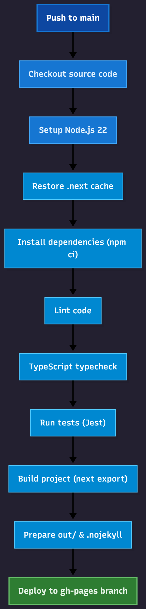

# Wealthix Advisors

This is a [Next.js](https://nextjs.org) project bootstrapped with [`create-next-app`](https://nextjs.org/docs/app/api-reference/cli/create-next-app).

## Getting Started

First, run the development server:

```bash
npm run dev
# or
yarn dev
# or
pnpm dev
# or
bun dev
```

Open [http://localhost:3000](http://localhost:3000) with your browser to see the result.

You can start editing the page by modifying `app/page.tsx`. The page auto-updates as you edit the file.

This project uses [`next/font`](https://nextjs.org/docs/app/building-your-application/optimizing/fonts) to automatically optimize and load [Geist](https://vercel.com/font), a new font family for Vercel.

## Learn More

To learn more about Next.js, take a look at the following resources:

## CI/CD to GitHub Pages

This project is configured as an SSG (static export) Next.js site and deploys to GitHub Pages via GitHub Actions on every push to `main`/`master`.

Highlights:

- Static export via Next 15 build (see `next.config.ts` with `output: 'export'`).
- Workflow file: `.github/workflows/workflow.yml`.
- Hard-coded `BASE_PATH` to `/wealthix-advisors` (repo: `Obsidian-Six/wealthix-advisors`).
- Publishes only the static export (`out/`) to the `gh-pages` branch, with a `.nojekyll` file.
- Reuses caches for npm and `.next/cache` to speed up builds on Actions free tier.

Test → Build → Deploy steps:

1. Lint and typecheck
2. Jest tests (jsdom)
3. `next build` (export happens during build)
4. Deploy `out/` to `gh-pages`

### CI workflow diagram

The high-level CI workflow is illustrated below (source: `docs/workflow.mmd`):



## Images on GitHub Pages (no manual basePath needed)

This project deploys to GitHub Pages under `/wealthix-advisors`. To avoid 404s for images at a non-root path, we configured a global custom loader for `next/image`:

- `next.config.ts`:
  - `output: 'export'`, `images.unoptimized: true`
  - `images.loader: 'custom'`, `images.loaderFile: './lib/loaders/image-loader.ts'`
- `lib/loaders/image-loader.ts` prefixes app-relative `src` values with `NEXT_PUBLIC_BASE_PATH`.
- CI sets both `BASE_PATH` and `NEXT_PUBLIC_BASE_PATH` to `/wealthix-advisors` during build. Locally, these are empty.

Usage stays the same—just use `next/image` normally:

```tsx
import Image from 'next/image'

export default function Example() {
   return <Image src="/logo.svg" alt="Logo" width={120} height={36} />
}
```

Edge cases and notes:

- Absolute URLs (https://...) and data URIs are left untouched by the loader.
- If you use plain ``, switch to `next/image` to benefit from the loader.
- `basePath` and `assetPrefix` are still applied globally by `next.config.ts` for routes and bundled assets.

If you use a custom domain:

1. Add your domain to `Settings > Pages` in GitHub.
2. Create a `public/CNAME` file containing your domain. It will be exported into `out/CNAME` during deploy.

Local static export:

1. Set `BASE_PATH` if you want to mimic GitHub Pages project path. Example on Windows PowerShell:

   - `$env:BASE_PATH = '/wealthix-advisors'`

2. Run build: `npm run build`.

3. Serve `out/` with any static server (e.g., `npx serve out`).

Local CI simulation (same as Actions):

```powershell
npm run ci:local
```

This runs tests, a production build, static export, and drops `.nojekyll` into `out/`.

## Testing

- Test runner: Jest with `jest-environment-jsdom`
- UI utils: `@testing-library/react` + `@testing-library/jest-dom`
- Config: `jest.config.mjs`, setup: `jest.setup.ts`

Run tests locally:

```powershell
npm test
```

## Scripts

- `dev`: start dev server with Turbopack
- `build`: production build (static export)
- `start`: start prod server (not used with GH Pages)
- `lint`: run ESLint
- `typecheck`: TypeScript type checking
- `test`: run Jest
- `ci:local`: simulate Actions locally (test → build → .nojekyll)

## Cleaning

To clean build artifacts on your machine, run:

```powershell
npm run clean
```

This removes `.next`, `.swc`, `out`, `node_modules`, and `coverage` after a one-time confirmation per run.

## Troubleshooting

- If images don’t load on GitHub Pages, ensure `images.unoptimized: true` is set in `next.config.ts`.
- If paths 404 on Pages, confirm `BASE_PATH=/wealthix-advisors` is set and links are relative to the base path.
- If CI is slow, verify npm and `.next/cache` caches are restored in the workflow run logs.

You can check out [the Next.js GitHub repository](https://github.com/vercel/next.js) - your feedback and contributions are welcome!

## Deploy on Vercel

The easiest way to deploy your Next.js app is to use the [Vercel Platform](https://vercel.com/new?utm_medium=default-template&filter=next.js&utm_source=create-next-app&utm_campaign=create-next-app-readme) from the creators of Next.js.

Check out our [Next.js deployment documentation](https://nextjs.org/docs/app/building-your-application/deploying) for more details.
